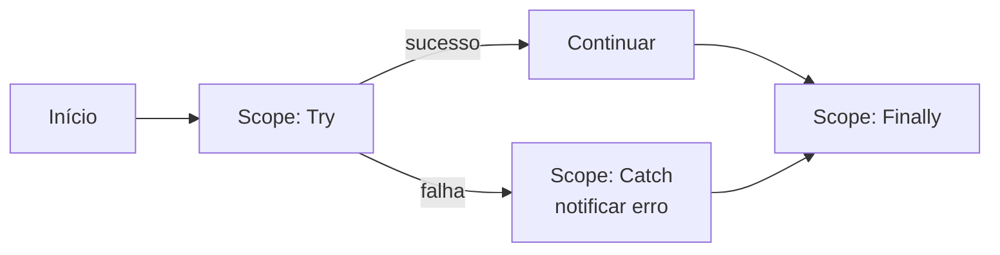

# Boas práticas de automação com Power Automate

Recomendações para criar fluxos **robustos, seguros e fáceis de manter**.

## 🏗️ Estrutura e legibilidade

- **Nomeie ações claramente**: prefira "Enviar e-mail de aprovação" em vez de "Enviar e-mail 2".
- **Use escopos (Scopes)** para agrupar etapas logicamente (ex.: `Try`, `Catch`).
- **Comente** decisões não óbvias na descrição das ações.

## 🛡️ Tratamento de erros

- Estruture fluxos críticos com o padrão **Try / Catch / Finally** usando escopos.
- Configure "**Executar após**" (configure run after) para capturar falhas.
- Notifique responsáveis quando um fluxo falhar.

## 🔐 Segurança

- **Nunca** coloque segredos, tokens ou senhas diretamente nas ações.
- Use **variáveis de ambiente** e o **Azure Key Vault** para segredos.
- Aplique o princípio do **menor privilégio** nas conexões.
- Prefira **contas de serviço** a contas pessoais para fluxos de produção.

## ⚡ Performance

- Ative a **concorrência** em loops `Apply to each` quando as iterações forem independentes.
- Use **filtros na consulta** (OData `$filter`) em vez de filtrar depois de trazer tudo.
- Evite chamadas desnecessárias dentro de loops.

## 🔁 Manutenção

- **Versione** a lógica dos fluxos (como neste acervo).
- Documente **gatilho, entradas e saídas** de cada fluxo.
- Padronize **prefixos de nomes** por ambiente (ex.: `[DEV]`, `[PROD]`).

## ✅ Checklist de qualidade

- [ ] Ações nomeadas de forma descritiva
- [ ] Tratamento de erros implementado
- [ ] Segredos fora do fluxo (Key Vault / variáveis de ambiente)
- [ ] Loops otimizados (concorrência/filtros)
- [ ] Documentação atualizada
