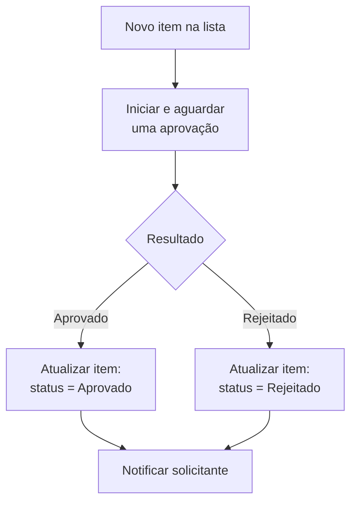

# Template 01 — Aprovação de Solicitações

Fluxo automatizado que dispara um processo de **aprovação** sempre que um novo item é criado em uma lista, notificando o solicitante do resultado.

## 🎯 Objetivo

Padronizar aprovações (ex.: pedidos de compra, solicitações de acesso, férias) de forma rastreável e automática.

## ⚡ Gatilho

**Quando um item é criado** em uma lista (ex.: SharePoint).

## 🧩 Conectores utilizados

- SharePoint (gatilho + atualização de item)
- Approvals (aprovação)
- Office 365 Outlook (notificação)

## 🖼️ Diagrama do fluxo

## ⚙️ Parâmetros a configurar

| Parâmetro | Descrição | Exemplo (fictício) |
|-----------|-----------|--------------------|
| `siteAddress` | Site do SharePoint | `https://contoso.sharepoint.com/sites/exemplo` |
| `listName` | Nome da lista monitorada | `Solicitacoes` |
| `approverEmail` | E-mail do aprovador | `aprovador@exemplo.com` |
| `statusColumn` | Coluna de status a atualizar | `Status` |

## 📝 Passo a passo

1. **Gatilho**: *Quando um item é criado* — selecione o site e a lista.
2. **Ação**: *Iniciar e aguardar uma aprovação* (tipo: Aprovar/Rejeitar).
   - Atribuído a: `approverEmail`
   - Título: `Nova solicitação: @{triggerBody()?['Title']}`
3. **Condição**: verifique se `Resultado` é `Approve`.
4. **Se sim**: atualize o item com status **Aprovado**.
5. **Se não**: atualize o item com status **Rejeitado**.
6. **Notificação**: envie e-mail ao solicitante com o desfecho.

## 💡 Variações e boas práticas

- Adicione **aprovação em várias etapas** para valores acima de um limite.
- Registre o histórico em uma lista de **auditoria**.
- Inclua **tratamento de erros** (veja [boas práticas](../../docs/02-boas-praticas.md)).

> ⚠️ Dados de exemplo são **fictícios**. Ajuste conexões e parâmetros ao seu ambiente.
