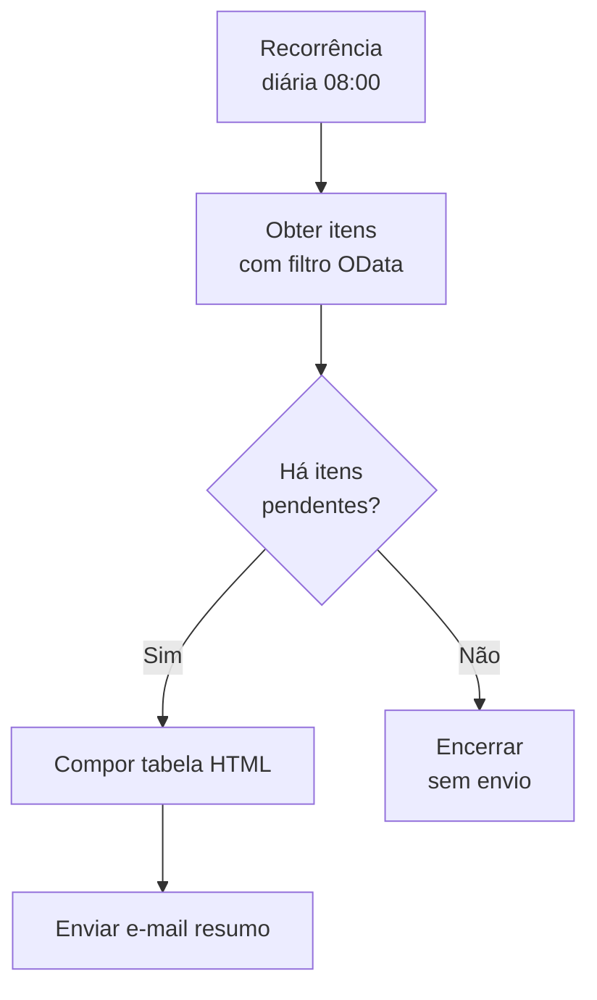

# Template 02 — Notificação de E-mail Agendada

Fluxo **agendado** (recorrente) que consulta itens pendentes e envia um e-mail-resumo aos responsáveis.

## 🎯 Objetivo

Automatizar lembretes/relatórios periódicos (ex.: tarefas pendentes, itens vencendo hoje) sem intervenção manual.

## ⚡ Gatilho

**Recorrência** (ex.: todo dia útil às 08:00).

## 🧩 Conectores utilizados

- Schedule (recorrência)
- SharePoint (consulta de itens)
- Office 365 Outlook (envio de e-mail)

## 🖼️ Diagrama do fluxo

## ⚙️ Parâmetros a configurar

| Parâmetro | Descrição | Exemplo (fictício) |
|-----------|-----------|--------------------|
| `frequency` | Frequência da recorrência | `Day` |
| `startTime` | Horário de início | `08:00` |
| `listName` | Lista consultada | `Tarefas` |
| `filterQuery` | Filtro OData | `Status eq 'Pendente'` |
| `recipients` | Destinatários do resumo | `equipe@exemplo.com` |

## 📝 Passo a passo

1. **Gatilho**: *Recorrência* — defina frequência e horário.
2. **Ação**: *Obter itens* (SharePoint) com **Filter Query** OData (`filterQuery`).
3. **Condição**: verifique `length(body('Obter_itens')?['value']) > 0`.
4. **Se houver itens**: use *Criar tabela HTML* para formatar o resumo.
5. **Envie** o e-mail com a tabela para `recipients`.

## 💡 Variações e boas práticas

- Filtre pela **query OData** (mais eficiente que filtrar após obter tudo).
- Envie **relatórios semanais** ajustando a recorrência.
- Anexe um **CSV** gerado a partir dos itens.

> ⚠️ Dados de exemplo são **fictícios**. Ajuste conexões e parâmetros ao seu ambiente.
