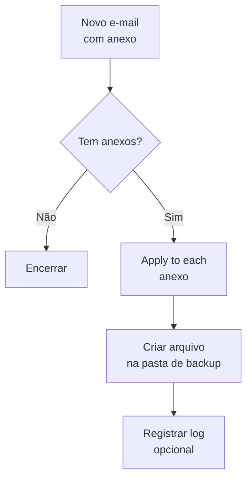

# Template 03 — Backup de Anexos em Nuvem

Fluxo automatizado que, ao receber um e-mail com anexos, salva cada arquivo em uma pasta de armazenamento em nuvem.

## 🎯 Objetivo

Centralizar e preservar anexos importantes automaticamente, evitando perda de arquivos e organizando por data.

## ⚡ Gatilho

**Quando um novo e-mail chega** (com anexos).

## 🧩 Conectores utilizados

- Office 365 Outlook (gatilho)
- OneDrive for Business / SharePoint (armazenamento)

## 🖼️ Diagrama do fluxo

## ⚙️ Parâmetros a configurar

| Parâmetro | Descrição | Exemplo (fictício) |
|-----------|-----------|--------------------|
| `folderPath` | Pasta de destino do backup | `/Backups/Anexos` |
| `onlyWithAttachments` | Filtrar só e-mails com anexo | `true` |
| `subjectFilter` | Filtro opcional por assunto | `Fatura` |

## 📝 Passo a passo

1. **Gatilho**: *Quando um novo e-mail chega (V3)* — ative **Somente com anexos** e defina filtros.
2. **Apply to each**: itere sobre `Anexos`.
3. **Ação**: *Criar arquivo* (OneDrive/SharePoint):
   - Caminho da pasta: `folderPath`
   - Nome do arquivo: `@{items('Apply_to_each')?['Name']}`
   - Conteúdo: `@{items('Apply_to_each')?['ContentBytes']}`
4. **(Opcional)** registre um log em uma lista com remetente, data e nome do arquivo.

## 💡 Variações e boas práticas

- Ative **concorrência** no *Apply to each* para acelerar múltiplos anexos.
- Organize por **subpastas de data** (`/Backups/Anexos/2026/01`).
- Filtre por **tipo de arquivo** (ex.: só `.pdf`) antes de salvar.
- Trate erros para não perder anexos em caso de falha pontual.

> ⚠️ Dados de exemplo são **fictícios**. Ajuste conexões e parâmetros ao seu ambiente.
