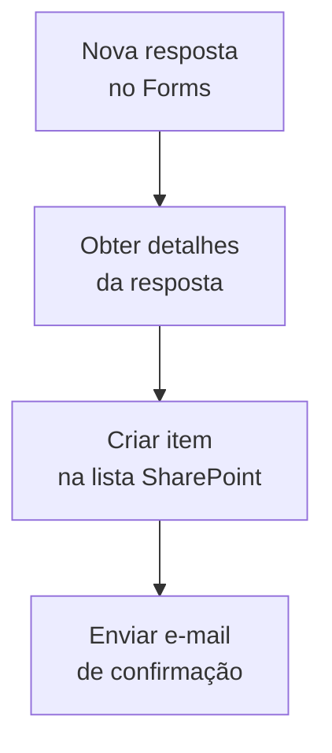

# Template 04 — Formulário → SharePoint

Fluxo automatizado que captura respostas de um **Microsoft Forms** e registra cada resposta como um item em uma lista do SharePoint, notificando o time.

## 🎯 Objetivo

Transformar formulários em uma fonte estruturada de dados, eliminando digitação manual (ex.: inscrições, chamados, pesquisas).

## ⚡ Gatilho

**Quando uma nova resposta é enviada** (Microsoft Forms).

## 🧩 Conectores utilizados

- Microsoft Forms (gatilho)
- Forms (obter detalhes da resposta)
- SharePoint (criar item)
- Office 365 Outlook (notificação)

## 🖼️ Diagrama do fluxo

## ⚙️ Parâmetros a configurar

| Parâmetro | Descrição | Exemplo (fictício) |
|-----------|-----------|--------------------|
| `formId` | ID do formulário | `FORM_EXEMPLO_123` |
| `siteAddress` | Site do SharePoint | `https://contoso.sharepoint.com/sites/exemplo` |
| `listName` | Lista de destino | `Inscricoes` |
| `notifyEmail` | E-mail para notificação | `time@exemplo.com` |

## 📝 Passo a passo

1. **Gatilho**: *Quando uma nova resposta é enviada* — selecione o formulário (`formId`).
2. **Ação**: *Obter detalhes da resposta* — usando o **Response Id** do gatilho.
3. **Ação**: *Criar item* (SharePoint) — mapeie cada campo do formulário para uma coluna.
4. **Notificação**: envie e-mail ao time confirmando o novo registro.

## 💡 Variações e boas práticas

- Valide campos obrigatórios com uma **condição** antes de criar o item.
- Direcione para **listas diferentes** conforme o tipo de resposta (Switch).
- Anexe as respostas a um **relatório periódico** (combine com o Template 02).

> ⚠️ Dados de exemplo são **fictícios**. Ajuste conexões e parâmetros ao seu ambiente.
