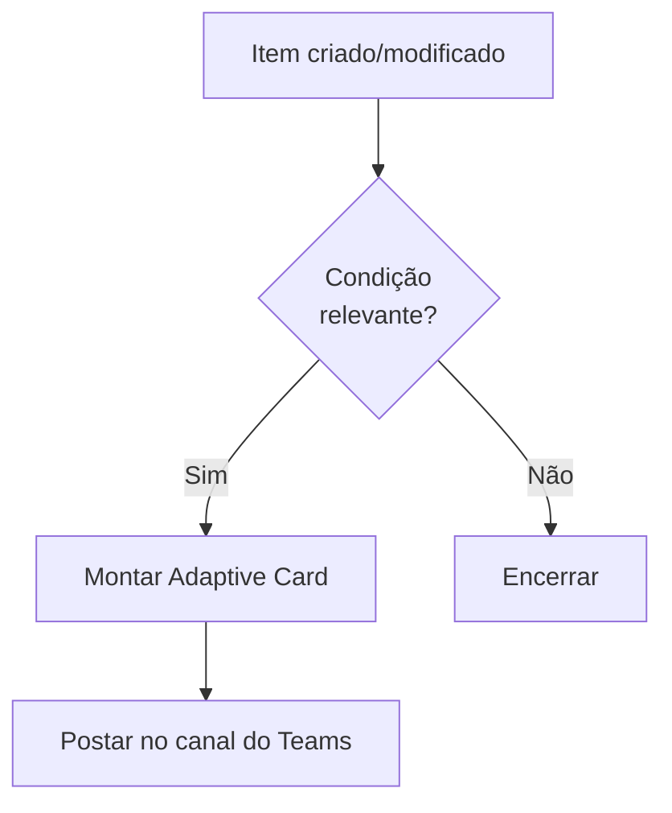

# Template 05 — Notificação no Microsoft Teams

Fluxo automatizado que publica um **cartão adaptável (Adaptive Card)** em um canal do Microsoft Teams sempre que um evento ocorre (ex.: novo item, alerta ou status crítico).

## 🎯 Objetivo

Levar informações relevantes diretamente ao canal da equipe, aumentando a visibilidade e a velocidade de resposta.

## ⚡ Gatilho

**Quando um item é criado ou modificado** em uma lista (ex.: SharePoint).

## 🧩 Conectores utilizados

- SharePoint (gatilho)
- Microsoft Teams (postar cartão adaptável)

## 🖼️ Diagrama do fluxo



## ⚙️ Parâmetros a configurar

| Parâmetro | Descrição | Exemplo (fictício) |
|-----------|-----------|--------------------|
| `siteAddress` | Site do SharePoint | `https://contoso.sharepoint.com/sites/exemplo` |
| `listName` | Lista monitorada | `Chamados` |
| `teamId` | ID da equipe (Team) | `TEAM_EXEMPLO_123` |
| `channelId` | ID do canal | `CHANNEL_EXEMPLO_456` |
| `priorityColumn` | Coluna usada na condição | `Prioridade` |

## 📝 Passo a passo

1. **Gatilho**: *Quando um item é criado ou modificado* — selecione o site e a lista.
2. **Condição**: filtre eventos relevantes (ex.: `Prioridade` = `Alta`).
3. **Ação**: *Postar seu próprio cartão adaptável como o Flow bot em um canal* (Teams).
   - Selecione `teamId` e `channelId`.
   - Use um JSON de **Adaptive Card** com título, campos e link para o item.

## 💡 Variações e boas práticas

- Use **cartões acionáveis** (botões) para aprovar/atribuir direto no Teams.
- Poste **mensagens diferentes** por prioridade (Switch).
- Combine com o Template 01 para notificar aprovações no canal.

## 🧾 Exemplo de Adaptive Card (resumido)

```json
{
  "type": "AdaptiveCard",
  "version": "1.4",
  "body": [
    { "type": "TextBlock", "size": "Large", "weight": "Bolder", "text": "🚨 Novo chamado de alta prioridade" },
    { "type": "TextBlock", "text": "Título: @{triggerBody()?['Title']}", "wrap": true }
  ],
  "actions": [
    { "type": "Action.OpenUrl", "title": "Abrir item", "url": "https://exemplo.com/item" }
  ]
}
```

> ⚠️ Dados de exemplo são **fictícios**. Ajuste conexões e parâmetros ao seu ambiente.
