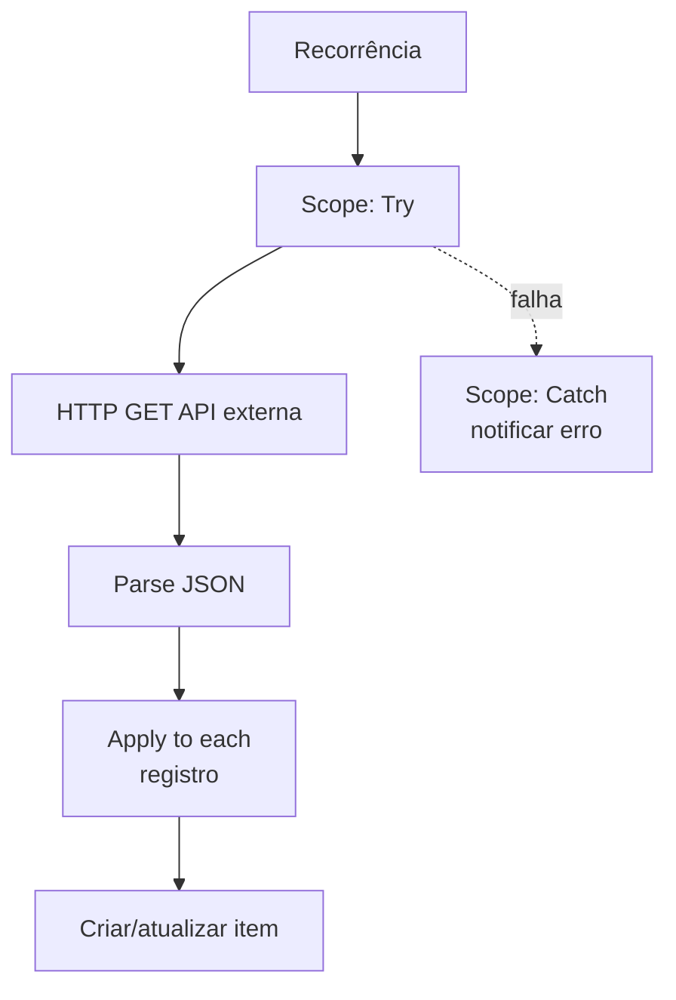

# Template 06 — Integração via HTTP com API Externa

Fluxo automatizado que consome uma **API REST externa** (via ação HTTP), trata a resposta JSON e registra os dados, demonstrando um padrão robusto de integração.

## 🎯 Objetivo

Integrar o Power Automate a sistemas externos (ERPs, serviços web, webhooks) de forma segura e resiliente.

## ⚡ Gatilho

**Recorrência** (ex.: a cada hora) — pode ser adaptado para gatilho instantâneo/HTTP request.

## 🧩 Conectores utilizados

- Schedule (recorrência)
- HTTP (requisição REST)
- Data Operations (Parse JSON)
- SharePoint (registro dos dados)

## 🖼️ Diagrama do fluxo

## ⚙️ Parâmetros a configurar

| Parâmetro | Descrição | Exemplo (fictício) |
|-----------|-----------|--------------------|
| `apiUrl` | Endpoint da API | `https://api.exemplo.com/v1/pedidos` |
| `authHeader` | Cabeçalho de autenticação | `Bearer @{variables('token')}` |
| `listName` | Lista para registro | `PedidosIntegrados` |

## 📝 Passo a passo

1. **Gatilho**: *Recorrência* — defina a frequência.
2. **Scope "Try"**: agrupe as ações de integração.
3. **Ação HTTP**: método `GET` para `apiUrl`, com cabeçalhos de autenticação.
4. **Parse JSON**: gere o schema a partir de uma resposta de exemplo.
5. **Apply to each**: itere sobre os registros retornados e crie/atualize itens.
6. **Scope "Catch"**: configure **"Executar após"** = *falhou* para notificar erros.

## 🔐 Segurança (importante)

- **Nunca** coloque o token diretamente na ação. Use **variáveis de ambiente** ou o **Azure Key Vault**.
- Prefira **conexões seguras (HTTPS)** e valide o **status code** da resposta.
- Trate limites de taxa (rate limit) com **retry/policy**.

## 💡 Variações e boas práticas

- Troque a recorrência por um gatilho **"Quando uma requisição HTTP é recebida"** para virar um **webhook**.
- Use **paginação** quando a API retornar muitos registros.
- Implemente **idempotência** (evite duplicar itens já integrados).

> ⚠️ Dados de exemplo são **fictícios**. Ajuste conexões, endpoints e credenciais ao seu ambiente.
