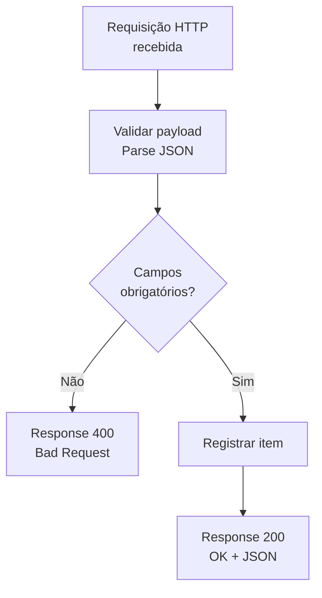

# Template 07 — Webhook (Requisição HTTP Recebida)

Fluxo instantâneo que expõe um **endpoint HTTP** para receber chamadas de sistemas externos (webhooks), valida o payload e responde de forma síncrona.

## 🎯 Objetivo

Permitir que sistemas externos acionem uma automação em **tempo real** (ex.: um app envia um evento e o fluxo processa imediatamente).

## ⚡ Gatilho

**Quando uma requisição HTTP é recebida** (gera uma URL de callback).

## 🧩 Conectores utilizados

- Request (gatilho HTTP)
- Data Operations (Parse/Compose)
- SharePoint (registro)
- Response (resposta HTTP síncrona)

## 🖼️ Diagrama do fluxo

## ⚙️ Parâmetros a configurar

| Parâmetro | Descrição | Exemplo (fictício) |
|-----------|-----------|--------------------|
| `schema` | Schema JSON esperado no corpo | ver `flow.example.json` |
| `listName` | Lista para registrar o evento | `EventosRecebidos` |
| `apiKeyHeader` | Cabeçalho de validação simples | `x-api-key` |

## 📝 Passo a passo

1. **Gatilho**: *Quando uma requisição HTTP é recebida* — informe o **schema JSON** do corpo.
2. **(Segurança)** valide um cabeçalho `apiKeyHeader` antes de processar.
3. **Condição**: verifique campos obrigatórios do payload.
4. **Se inválido**: use *Response* com status **400**.
5. **Se válido**: registre o item e responda com *Response* status **200** e um JSON de confirmação.

## 🔐 Segurança (importante)

- A URL do gatilho contém uma **assinatura (SAS)** — trate-a como **segredo**.
- Valide um **cabeçalho/token** próprio (`apiKeyHeader`) para evitar chamadas não autorizadas.
- Nunca registre o token/segredo em logs ou itens.

## 💡 Variações e boas práticas

- Responda **202 Accepted** e processe de forma assíncrona para cargas longas.
- Use **idempotência** (chave única do evento) para evitar processamento duplicado.
- Documente o **contrato da API** (payload de entrada e resposta).

> ⚠️ Dados de exemplo são **fictícios**. Ajuste conexões, schema e parâmetros ao seu ambiente.
