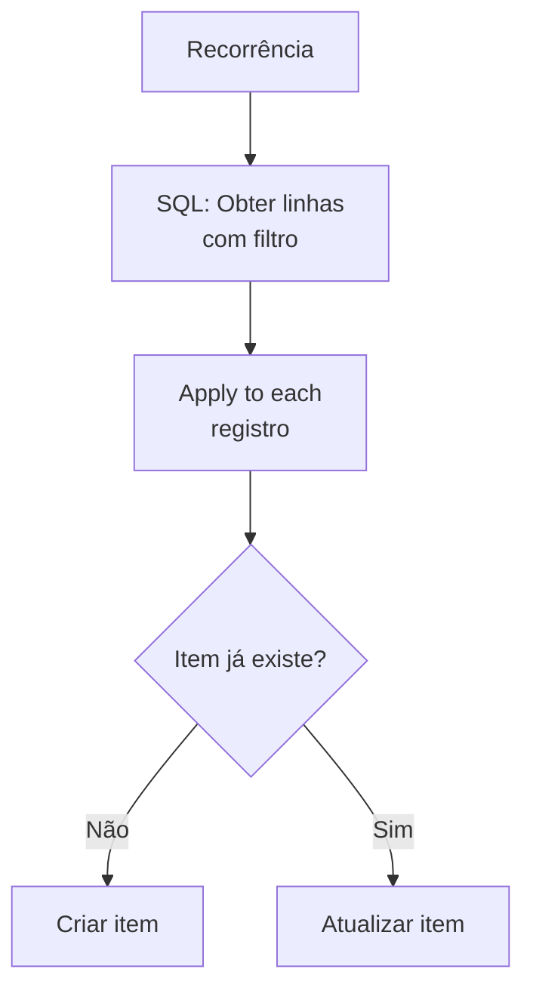

# Template 08 — Sincronização com SQL Server

Fluxo agendado que lê registros de uma tabela **SQL Server** e sincroniza os dados com uma lista do SharePoint (ou vice-versa), mantendo os sistemas alinhados.

## 🎯 Objetivo

Manter dados consistentes entre um **banco relacional** e o ecossistema Microsoft 365, evitando exportações manuais.

## ⚡ Gatilho

**Recorrência** (ex.: a cada 15 minutos ou diariamente).

## 🧩 Conectores utilizados

- Schedule (recorrência)
- SQL Server (obter linhas)
- SharePoint (criar/atualizar item)
- Data Operations (filtros)

## 🖼️ Diagrama do fluxo

## ⚙️ Parâmetros a configurar

| Parâmetro | Descrição | Exemplo (fictício) |
|-----------|-----------|--------------------|
| `sqlServer` | Servidor SQL | `sqlserver-exemplo.database.windows.net` |
| `database` | Banco de dados | `VendasDB` |
| `tableName` | Tabela de origem | `[dbo].[Pedidos]` |
| `filterQuery` | Filtro OData na consulta | `Status eq 'Novo'` |
| `keyColumn` | Coluna chave para deduplicação | `PedidoId` |

## 📝 Passo a passo

1. **Gatilho**: *Recorrência* — defina a frequência de sincronização.
2. **Ação SQL**: *Obter linhas (V2)* — selecione `tableName` e aplique `filterQuery`.
3. **Apply to each**: itere sobre os registros.
4. **Verificação**: consulte o SharePoint por `keyColumn` para saber se o item já existe.
5. **Condição**: **criar** (novo) ou **atualizar** (existente) o item.

## 🔐 Segurança (importante)

- Use uma **conexão gerenciada** (Managed Identity / credenciais seguras), nunca strings de conexão em texto.
- Aplique o princípio do **menor privilégio** no usuário SQL (somente leitura, se possível).
- Prefira **Azure SQL** com firewall e endpoints privados.

## 💡 Variações e boas práticas

- Ative a **paginação** para tabelas grandes.
- Use uma coluna de **carimbo de data/hora** (`ModifiedAt`) para sincronizar apenas o que mudou (delta).
- Registre um **log de sincronização** (quantidade de criados/atualizados).

> ⚠️ Dados de exemplo são **fictícios**. Ajuste servidor, banco, tabela e credenciais ao seu ambiente.
