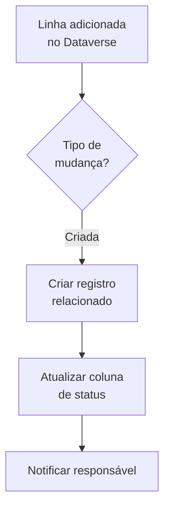

# Template 09 — Integração com Dataverse

Fluxo automatizado que reage a mudanças em uma tabela do **Microsoft Dataverse** (o banco de dados nativo do Power Platform) e executa ações relacionadas, como criar registros vinculados e notificar.

## 🎯 Objetivo

Automatizar processos de negócio centrados em dados no **Dataverse**, aproveitando gatilhos nativos, relacionamentos e regras de negócio.

## ⚡ Gatilho

**Quando uma linha é adicionada, modificada ou excluída** (Microsoft Dataverse).

## 🧩 Conectores utilizados

- Microsoft Dataverse (gatilho e ações)
- Office 365 Outlook (notificação)

## 🖼️ Diagrama do fluxo

## ⚙️ Parâmetros a configurar

| Parâmetro | Descrição | Exemplo (fictício) |
|-----------|-----------|--------------------|
| `environment` | Ambiente Dataverse | `org-exemplo (Default)` |
| `tableName` | Tabela monitorada | `Oportunidades` |
| `scope` | Escopo do gatilho | `Organization` |
| `relatedTable` | Tabela relacionada | `Tarefas` |
| `statusColumn` | Coluna de status | `situacao` |

## 📝 Passo a passo

1. **Gatilho**: *Quando uma linha é adicionada, modificada ou excluída* — selecione `environment`, `tableName` e `scope`.
2. **Condição**: verifique o **tipo de operação** (criada/modificada).
3. **Ação**: *Adicionar uma nova linha* na tabela relacionada (`relatedTable`), vinculando pela chave.
4. **Ação**: *Atualizar uma linha* — ajuste o `statusColumn` do registro original.
5. **Notificação**: envie e-mail ao responsável.

## 🔐 Segurança e governança (importante)

- Respeite as **permissões e papéis de segurança** do Dataverse (segurança em nível de linha).
- Use **variáveis de ambiente** para IDs de ambiente/tabela em soluções portáveis.
- Empacote o fluxo em uma **Solution** para transporte entre DEV → HML → PROD.

## 💡 Variações e boas práticas

- Use **colunas de escolha (choice)** em condições no lugar de texto livre.
- Combine com **Business Rules** e **Fluxos em tempo real** quando fizer sentido.
- Aplique **filtros de coluna** no gatilho para reduzir execuções desnecessárias.

> ⚠️ Dados de exemplo são **fictícios**. Ajuste ambiente, tabelas e colunas ao seu contexto.
